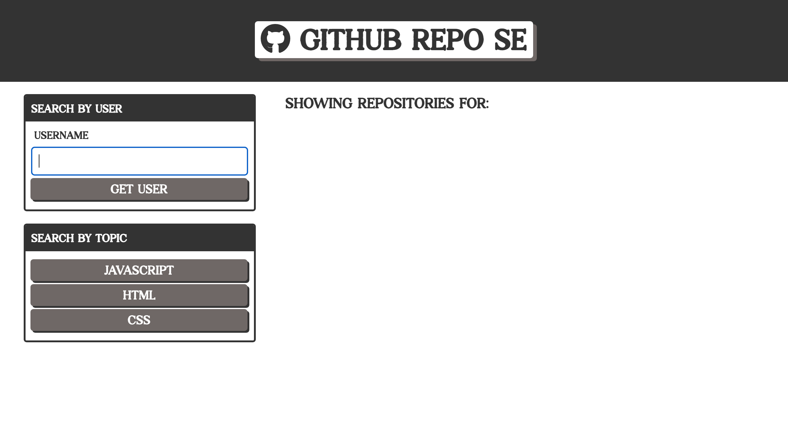

# Git It Done

## Description
Application that displays GitHub repositories for a given user or selected language type via dynamically updated HTML and CSS. Repository data is being retrieved from the GitHub API (https://docs.github.com/en/rest)

## License  
This application is covered under the following license. Please review the link below for additional information pertaining to the license.
    
  
https://www.gnu.org/licenses/gpl-3.0

## Table of Contents
[Deployed Application](#deployed-application)  
[Built With](#built-with)  
[Landing Page](#landing-page)  
[Contribution](#contribution)  

## Deployed Application
https://dylanhay.github.io/git-it-done/
## Built With
* JavaScript
* HTML
* CSS
* Git
* GitHub Pages

## Landing Page

## Contribution
Built by Dylan Hay